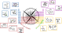

# TAE-PTComp: Total Atomization Energy Periodic Table Compass

[](LICENSE.txt)

<p align="center">
  
</p>

**TAE-PTComp** is an element-resolved total atomization energy benchmark designed to probe the transferability of quantum chemical methods across a broad region of the periodic table.

The dataset contains **2097 closed-shell, single-reference molecular systems** organized into **67 element-centered subsets**. It covers molecules with up to **50 atoms**, including neutral, cationic, and anionic species, and provides high-level coupled cluster reference data for total atomization energies (TAEs).

TAE-PTComp is intended for benchmarking, validation, and development of approximate electronic-structure methods, including density functional approximations, semi-empirical quantum mechanical methods, and machine-learning interatomic or molecular energy models.

---

## Dataset at a glance

| Quantity | Description |
| --- | --- |
| Target property | Total atomization energy (TAE) |
| Reference level | PNO-LCCSD(T*)-F12 coupled cluster reference energies |
| Systems | 2097 molecules |
| Element-centered subsets | 67 |
| Average subset size | 31 structures per element on average |
| Molecular size | Up to 50 atoms |
| Charge states | Neutral, cationic, and anionic systems (`0`, `+1`, `-1`) |
| Chemical space | Covalent and coordinative compounds, noncovalently bound clusters, crystal cut-outs, atomic clusters, and selected “mindless” structures |
| Main analysis metric | Scaled TAE, `sTAE = TAE / N_atoms` |

The benchmark can be analyzed either in terms of the 67 element-resolved subsets or in terms of four broader periodic-table regions:

- `s-block`
- `p-block (light)`
- `p-block (heavy)`
- `transition metals`

---

## Repository structure

```text
.
├── TAE-PTComp/
│   ├── <system>/
│   │   ├── coord
│   │   ├── struc.xyz
│   │   ├── .CHRG
│   │   └── .UHF
│   └── ...
├── RAW_DATA/
│   ├── RAW_DATA.xlsx
│   ├── RAW_DATA.numbers
│   └── csv/
│       ├── Atomic_energies_Hartree.csv
│       ├── Molecular_energies_Hartree.csv
│       ├── Reference_atomic_energies_Hartree.csv
│       ├── Total_atomization_energies_kcalmol.csv
│       └── MR_diagnostics.csv
├── data_post-processing/
│   ├── analyze.py
│   ├── .atom_number
│   ├── .corresponding_element
│   ├── ALL_OUT/
│   └── RESULTS/
├── LICENSE.txt
└── README.md
```

---

## File formats

### Structure files

Each system in `TAE-PTComp/` is stored in its own directory and contains:

| File | Description |
| --- | --- |
| `coord` | Molecular geometry in `coord` format |
| `struc.xyz` | Molecular geometry in XYZ format |
| `.CHRG` | Total molecular charge |
| `.UHF` | Number of unpaired electrons (relevant for atomic reference species) |

The molecular geometries were optimized at r2SCAN-3c level of theory.

### Raw numerical data

The directory `RAW_DATA/` contains the publication reference data in spreadsheet and plain-text formats.

| File | Contents |
| --- | --- |
| `RAW_DATA.xlsx` | Complete raw-data workbook |
| `RAW_DATA.numbers` | Complete raw-data workbook in Apple Numbers format |
| `csv/Total_atomization_energies_kcalmol.csv` | Reference total atomization energies in kcal mol⁻¹ |
| `csv/Molecular_energies_Hartree.csv` | Molecular electronic energies in Hartree |
| `csv/Atomic_energies_Hartree.csv` | Atomic energies in Hartree |
| `csv/Reference_atomic_energies_Hartree.csv` | Atomic reference energies used for the atomization reactions |
| `csv/MR_diagnostics.csv` | Multi-reference diagnostic data used during dataset curation |

---

## Reference energies and atomization reactions

The target quantity is the electronic total atomization energy. For a neutral molecule,

```text
A_a B_b C_c → a A + b B + c C
```

For charged systems, ionic atomization reactions are defined explicitly so that the molecular charge is assigned to an atomic fragment according to the reaction protocol described in the associated paper. The provided atomic reference energies and reaction definitions should be used consistently when benchmarking new methods.

For statistical analyses, we recommend using the scaled atomization energy,

```text
sTAE_i = TAE_i / N_atoms,i
```

and the corresponding scaled error statistics. This avoids global error measures being dominated by the largest molecules in the benchmark.

---

## Post-processing and error analysis

The `data_post-processing/` directory contains a small Python script for computing element-resolved and block-resolved scaled error statistics from method output files.

### Requirements

```bash
python >= 3.8
numpy
```

### Example usage

Analyze one method-output file:

```bash
cd data_post-processing
python analyze.py ALL_OUT/wB97M-V.out
```

Analyze all method-output files stored in `ALL_OUT/`:

```bash
cd data_post-processing
python analyze.py all
```

The script writes results to:

```text
data_post-processing/RESULTS/element_resolved/
data_post-processing/RESULTS/block_resolved/
```

The reported statistics are based on signed scaled deviations,

```text
scaled deviation = (method TAE - reference TAE) / N_atoms
```

and include:

| Statistic | Meaning |
| --- | --- |
| `sMSE` | scaled mean signed error |
| `sMAE` | scaled mean absolute error |
| `sRMSE` | scaled root mean square error |
| `STD` | standard deviation of signed scaled errors |

The `ALL_OUT/` directory contains example output files for several methods, including `PBE-D4`, `r2SCAN-D4`, `M06-2X`, `PBE0-D4`, `B3LYP-D4`, `wB97M-V`, `UMA`, and `gxTB`.

---

## Citation

If you use TAE-PTComp, please cite the associated paper. The final journal reference and DOI should be inserted once available.

```bibtex
@article{Dahl_TAE_PTComp,
  title   = {An element-resolved coupled cluster atomization energy data set ranging across the periodic table},
  author  = {Dahl, Robin and M{\"u}ller, Marcel and Kniebes, Vanessa and Werner, Hans-Joachim and Grimme, Stefan and Hansen, Andreas},
  journal = {submitted},
  year    = {2026},
  note    = {TAE-PTComp: Total Atomization Energy Periodic Table Compass}
}
```

---

## License

This repository is distributed under the terms of the [MIT License](LICENSE.txt).

---

## Contact

For questions about the dataset, reference calculations, or benchmark usage, please open an issue in this repository or contact the authors of the associated paper.
